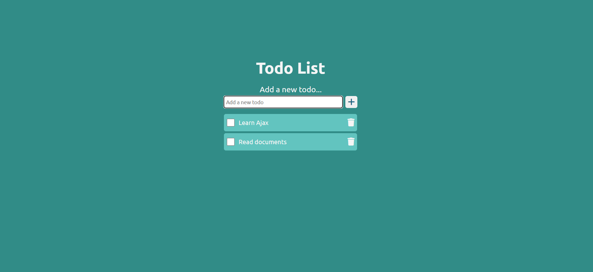

# Todo List 網頁應用

🟢 [立即查看 DEMO](https://gpyuan.github.io/todo-list/)

這是一個簡單的 Todo List 網頁應用，支援新增、刪除、完成打勾與加上刪除線，並使用瀏覽器的 `localStorage` 儲存清單資料

## 專案特色

- ✅ 新增待辦事項（附帶動畫效果）
- 🗑️ 刪除待辦事項（附帶動畫效果）
- ✔️ 標記完成事項（會自動加上刪除線）
- 💾 使用 `localStorage` 保存資料
- 🎨 使用 SCSS 撰寫樣式，具備良好結構
- ⌨️ 支援按 Enter 鍵快速新增
- 📱 基本 RWD（手機螢幕支援）

## 預覽畫面

下面是 Todo List 網頁的截圖：



## 如何使用

1. **下載或複製專案**  
   將專案檔案下載至您的電腦，或使用 Git clone 指令複製儲存庫。

2. **開啟網頁**  
   直接開啟 `index.html` 檔案。

3. **開始使用**
   - 在輸入框中輸入您的待辦事項，然後按 Enter 鍵或點擊「新增」按鈕。
   - 點擊每個項目旁的勾選圖示來標記完成。
   - 點擊垃圾桶圖示來刪除單一項目。

## 使用技術

- HTML5
- SCSS（已編譯為 CSS）
- JavaScript（Vanilla JS）
- Font Awesome（圖示庫）
- Google Fonts（Ubuntu 字體）

## 專案結構

```
todolist/
├── index.html
├── app.js
├── style/
│ ├── style.scss
│ └── style.css
├── README.md
└── screenshot.png
```
